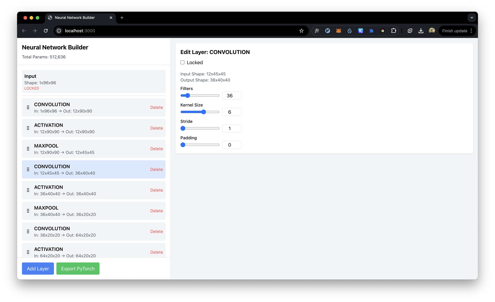

<a href="https://lucasaschenbach.github.io/nn-builder/">
  <h1 align="center">Neural Network Builder</h1>
</a>

<p align="center">
  A visual tool for building and configuring neural networks.
</p>

<p align="center">
  <a href="#features"><strong>Features</strong></a> ·
  <a href="#getting-started"><strong>Run Locally</strong></a> ·
  <a href="#contribution-guidelines"><strong>Contributing</strong></a> ·
  <a href="#feedback"><strong>Feedback</strong></a>
</p>
<br/>

A visual tool for building and configuring neural networks without the hassle of manual shape computations or parameter calculations. Designed to allow fast iteration when creating deep learning models, this tool provides an intuitive interface for managing layers, configuring parameters, and exporting models to PyTorch.




## Features

- **No Manual Computations**: Automatically recalculates input-output shapes for all layers.
- **Drag-and-Drop Interface**: Reorder layers effortlessly.
- **Supported Layers**:
  - Convolutional (`Conv2d`)
  - Max Pooling (`MaxPool2d`)
  - Fully Connected (`Linear`)
  - Flatten (`Flatten`)
  - Activation Functions (`ReLU`, `Sigmoid`, `Tanh`, `Softmax`)
- **Input Shape Specification**: Configure the input dimensions directly in the interface.
- **Code Export**: Generate PyTorch code for the designed model with a single click.
- **Parameter Visualization**: View the total number of trainable parameters in your network.
- **Lock Layers**: Prevent specific layers from being modified during reordering or recalculations.
- **User-Friendly Editing**: Adjust layer parameters using sliders or type values manually.


## Getting Started

### Running Locally

Follow these steps to run the project locally:

1. **Clone the Repository**:
   ```bash
   git clone https://github.com/lucasaschenbach/nn-builder.git
   cd nn-builder
   ```

2. **Install Dependencies**:
   Ensure you have Node.js installed, then run:
   ```bash
   npm install
   ```

3. **Start the Development Server**:
   ```bash
   npm run dev
   ```

4. **Open the Application**:
   Visit [http://localhost:3000](http://localhost:3000) in your browser.


## How to Use

1. **Specify Input Dimensions**: Click the input card at the top to define the input shape of your network (e.g., `[Channels, Height, Width]`).
2. **Add Layers**: Use the "Add Layer" button to add new layers like Conv, MaxPool, Linear, or Activation.
3. **Edit Layers**: Select any layer to configure its parameters. Adjust sliders or type values manually.
4. **Reorder Layers**: Drag and drop layers to change their order.
5. **Export to PyTorch**: Click the "Export PyTorch" button to generate and copy PyTorch code for your network.


## Contribution Guidelines

We welcome contributions! Here's how you can contribute:

### Adding a New Layer

To add support for a new layer type, follow these steps:

1. **Create a New Layer Class**:
   - Add a new file in `domain/layers/` (e.g., `BatchNormLayer.ts`).
   - Extend the `BaseLayer` class and implement:
     - `calcOutputShape`: Define how the layer calculates its output shape based on the input.
     - `calcNumParams`: Define how the layer calculates its trainable parameters.
     - `toPyTorchModule`: Define how the layer is represented in PyTorch code.

   Example for a Batch Normalization Layer:
   ```typescript
   import { BaseLayer, Shape } from './BaseLayer';

   export class BatchNormLayer extends BaseLayer {
     constructor(inputShape: Shape, locked = false) {
       super(inputShape, locked);
     }

     get typeName() {
       return 'batchnorm';
     }

     calcOutputShape(): void {
       // BatchNorm does not change the shape
       this.outputShape = { dims: [...this.inputShape.dims] };
     }

     calcNumParams(): number {
       const [channels] = this.inputShape.dims;
       // BatchNorm has two parameters for each channel: gamma and beta
       return channels * 2;
     }

     toPyTorchModule(): string {
       const [channels] = this.inputShape.dims;
       return `nn.BatchNorm2d(${channels})`;
     }
   }
   ```

2. **Export the New Layer**:
   - Add your new layer to `domain/layers/index.ts`:
     ```typescript
     export { BatchNormLayer } from './BatchNormLayer';
     ```
   - Add your new layer to `LayerType`:
     ```typescript
     export type LayerType = ... | 'batchnorm';
     ```

3. **Integrate the Layer**:
   - Update the `handleAddLayer` function in `page.tsx` to include the new layer type.
   - Add a button for the new layer in the "Add Layer" dropdown:
     ```tsx
     <button
       className="block w-full text-left px-4 py-2 hover:bg-gray-100"
       onClick={() => handleAddLayer('batchnorm')}
     >
       BatchNorm
     </button>
     ```
   - Add a layer editor in `components/LayerEditor.tsx`
     ```tsx
     {/* Batchnorm Editor */}
     {layer instanceof BatchNormLayer && (
       <div className="text-sm text-gray-600">
         <p>BatchNorm doesn&apos;t have any parameters to configure.</p>
       </div>
     )}
     ```

4. **Test Your Layer**:
   - Add the new layer in the UI.
   - Verify that input-output shapes, parameter counts, and PyTorch export work as expected.

### General Contribution Workflow

1. Fork the repository.
2. Create a new branch for your feature or bug fix:
   ```bash
   git checkout -b feature-new-layer
   ```
3. Make your changes and commit:
   ```bash
   git add .
   git commit -m "Add BatchNorm layer support"
   ```
4. Push to your fork:
   ```bash
   git push origin feature-new-layer
   ```
5. Open a pull request describing your changes.


## License

This project is licensed under the [MIT License](LICENSE).


## Feedback

We’d love to hear from you! If you encounter issues or have suggestions for improvements, please [open an issue](https://github.com/lucasaschenbach/nn-builder/issues) on GitHub.
